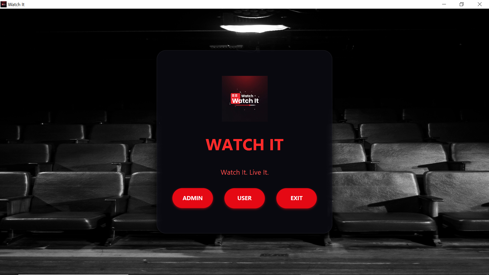
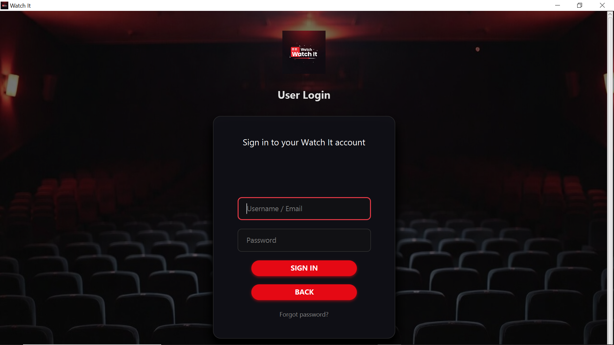
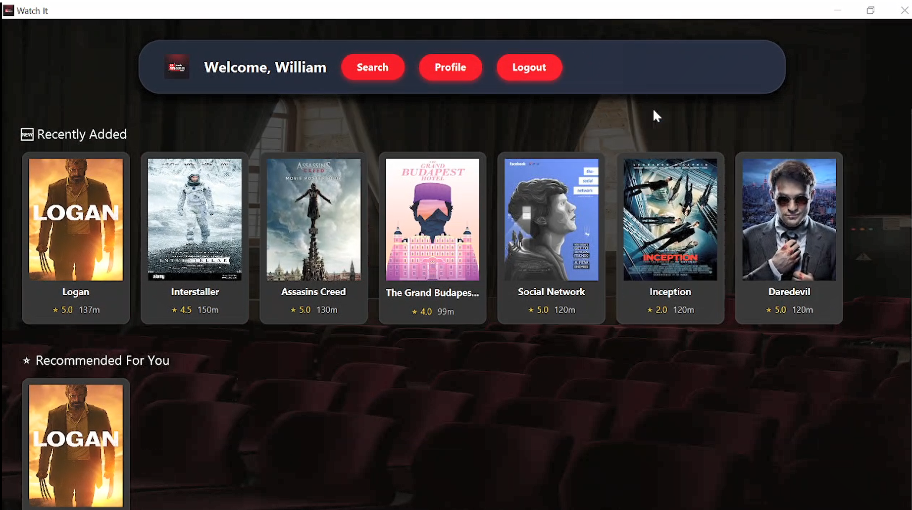
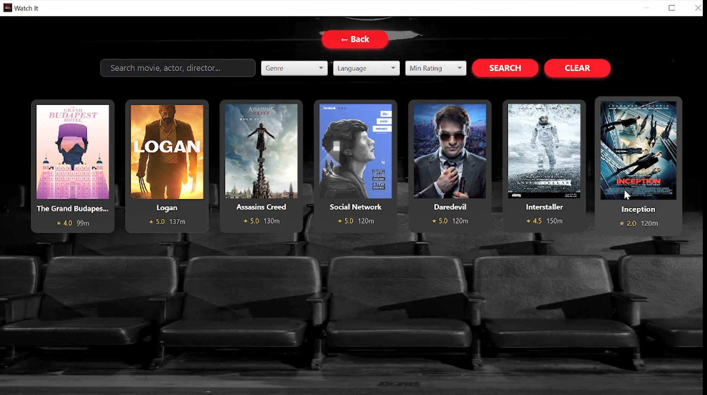
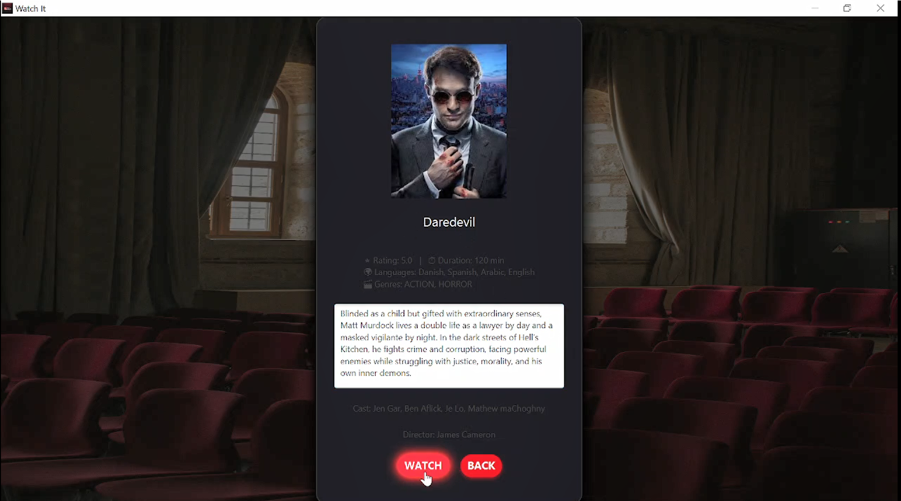
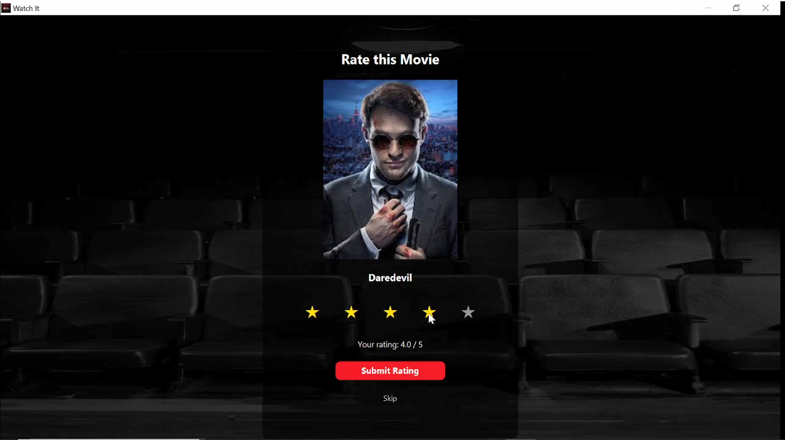
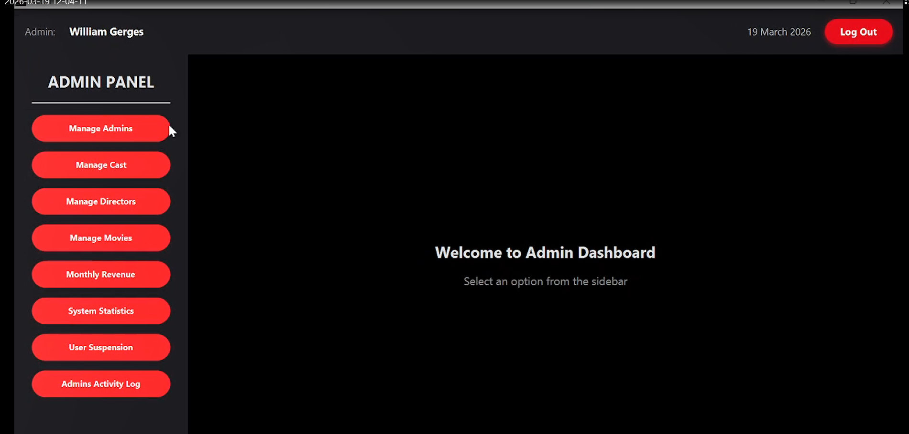
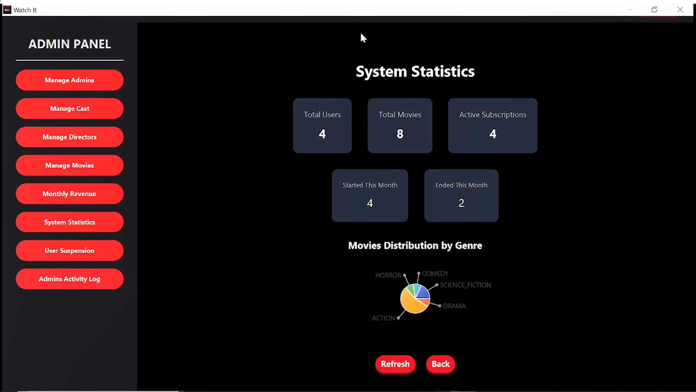
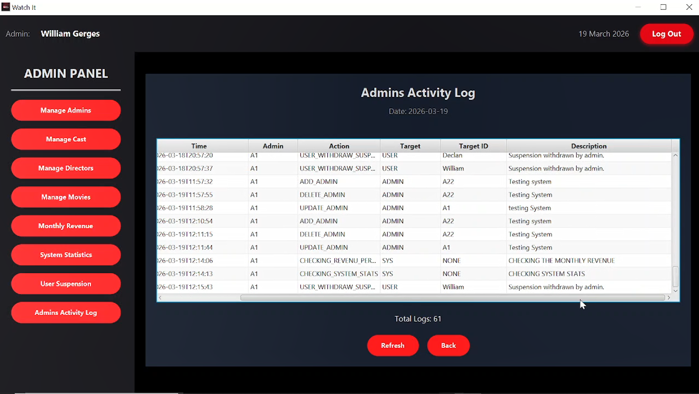
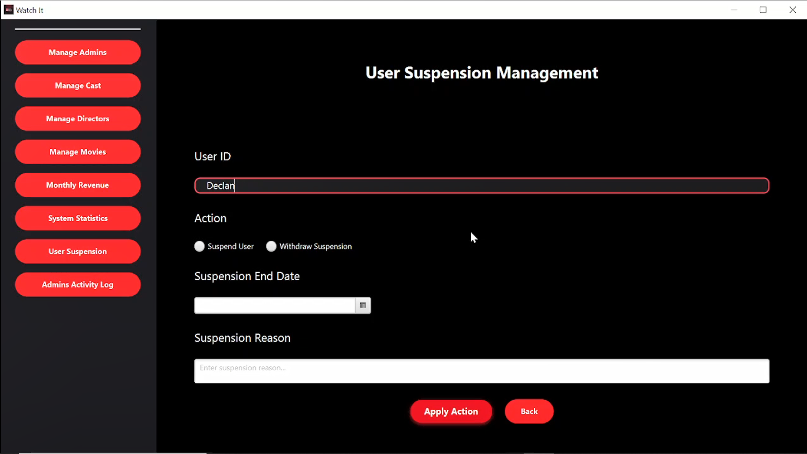

# 🎬 WatchIt – Desktop Streaming Platform


## 📌 Overview
WatchIt is a desktop streaming platform built using Java that simulates a real-world system with both user and admin functionalities.

The project was not only about building features, but about progressively evolving the system architecture:

- Starting with file-based storage  
- Moving to a MySQL database  
- Finally building a full GUI using JavaFX  

This approach helped in understanding how real applications grow and scale over time.

---

## 🚀 Features

### 👤 User Features
- User authentication (Login / Sign Up / Subscription renewal)  
- Browse movies by categories (Top Rated, Recent, etc.)  
- Search and filter movies (by name, genre, language, rating)  
- Watch movies and rate them  
- Profile system:  
  - Track watched movies  
  - Favorite genre  
  - Average rating  
  - Subscription management  
  - Suspension handling (with reason and duration)  

### 🛠️ Admin Features
- Secure admin authentication  
- Full CRUD operations:  
  - Movies  
  - Directors  
  - Cast  
- User management (suspend / unsuspend users)  
- System statistics dashboard  
- Monthly revenue tracking  
- Admin activity logging (stored in database)  

---

## 🧠 Architecture & Design
This project focuses on applying clean design principles:

- Separation between UI and business logic  
- Feature-based modular structure  
- Each class/function has a single responsibility  

**Key Concepts Applied:**
- Separation of Concerns  
- Single Responsibility Principle  
- Modular Design  

---

## 🛠️ Tech Stack
- **Language:** Java (OOP)  
- **GUI:** JavaFX  
- **Database:** MySQL  
- **Database Connectivity:** JDBC  

---

## 🔄 Project Evolution
One of the main goals of this project was continuous improvement:

- **Phase 1:** File-based system (initial implementation)  
- **Phase 2:** Database integration using MySQL  
- **Phase 3:** Full GUI development using JavaFX  

This reflects how real-world systems evolve over time.

---

## 🎥 Demo
👉 https://drive.google.com/drive/folders/1lTZSvmfIX4uF39kjiduTVhHYFx7Zurem?usp=drive_link

## 📸 Screenshots
### Main Screen

### Login Screen

### Dashboard

### Movie Browser

### Movie Card

### Ratting

### Admin Dashboard

### Adding Movie

### System Analysis

### Activity Log

### Suspention

---

## 📂 Project Structure
WatchIt/
│── src/
│   ├── ui/              # JavaFX UI components
│   ├── services/        # Business logic
│   ├── models/          # Data models
│   ├── database/        # Database handling (JDBC)
│   ├── utils/           # Helper classes
│
│── resources/
│   ├── fxml/            # JavaFX layouts
│
│── README.md


## ⚙️ How to Run
1. Clone the repository:
   ```bash
   git clone https://github.com/williammounir/WatchIt-Streaming-Platform
2. Open the project in your IDE (IntelliJ / Eclipse)

3. Set up MySQL:

- **Create the database

- **Import the required tables (if applicable)
4. Run the application:

- **Launch the main JavaFX file

What I Learned
- **How to design and structure a scalable application

- **Transitioning from file-based systems to databases

- **Building desktop GUIs using JavaFX

- **Managing complexity as the project grows

- **Thinking in terms of systems, not just code

## 🤝 Feedback
I’d really appreciate any feedback or suggestions!
